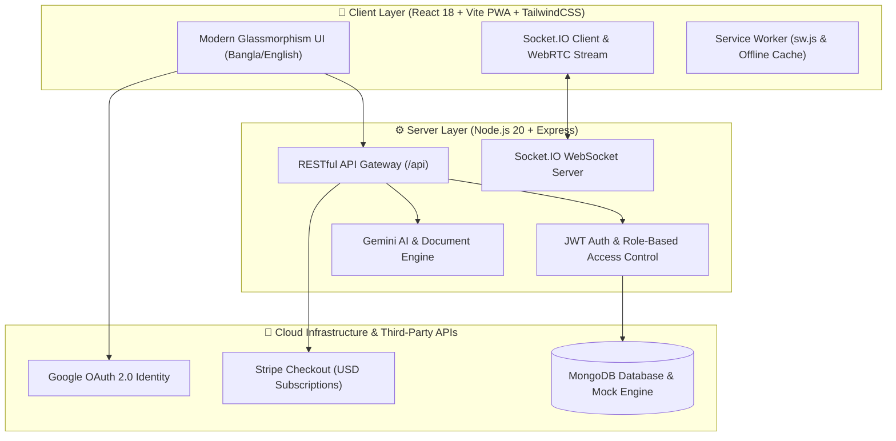

<div align="center">

# 🚀 StartupForge 2.0 — AI-Powered Startup Team Ecosystem & ATS Platform

### *Build High-Impact Teams, Conduct Live Video Interviews, and Automate Co-Founder Equity Agreements*

[](https://github.com/sojibahmedshorif25-ai/startupforge)
[](https://startupforge-ruby.vercel.app/)
[](https://react.dev/)
[](https://nodejs.org/)
[](https://socket.io/)
[](https://webrtc.org/)
[](https://stripe.com/)
[](https://www.mongodb.com/)

[🌐 **Explore Live Production Application**](https://startupforge-ruby.vercel.app/) • [⚡ **API Health Endpoint**](https://startupforge.onrender.com/api/health)

</div>

---

## 🔐 Production Authentication & Role-Based Access

The platform supports direct **Google OAuth 2.0 Sign-In** and **Real Email & Password Registration**:

| Role | Email | Password | Key Features Accessible |
| :--- | :--- | :--- | :--- |
| 🛡️ **Master Admin** | `sojibahmedshorif25@gmail.com` | `Sojibboss@231946##` | Full User Moderation, Startup Approvals, Revenue Analytics |
| 🚀 **Founder** | `alex.founder@techvision.io` | `Founder123!` | Post Ventures, Drag-and-Drop ATS Kanban Board, AI Pitch Decks |
| 🤝 **Collaborator** | `dev.john@gmail.com` | `User123!` | AI Skill Matcher, Resume Analyzer, 1-Click Role Applications |

---

## 🏗️ System Architecture & Workflow



---

## ✨ Enterprise-Grade Key Features

- 💬 **Real-time Live Chat (`Socket.IO`)**: Sub-millisecond direct candidate messaging with live typing status.
- 🎥 **In-App HD Video Interviews (`WebRTC`)**: 1-on-1 technical interview rooms with camera/microphone toggle and screen sharing.
- 🤖 **AI Pitch Deck & Equity Agreement Generator**: Generates investor-ready Pitch Decks and Co-Founder Contracts exported to PDF via `jspdf` & `html2canvas`.
- 📋 **ATS Drag-and-Drop Kanban Board (`@dnd-kit`)**: Modern applicant tracking pipeline (`Applied` ➔ `Accepted` ➔ `Declined`).
- 📱 **Progressive Web App (`PWA`)**: Offline caching with `workbox` and native mobile install support.
- 💳 **Stripe Subscription Billing**: Secure payment gateway for founders to unlock unlimited recruitment pipelines.
- 🌐 **Bilingual (English & Bengali)**: High-contrast Dark/Light theme with seamless language toggle.

---

## 🛠️ Complete Tech Stack

| Domain | Technologies |
|:---|:---|
| **Frontend** | React 18, Vite 5, Tailwind CSS 3, Framer Motion, Recharts, `@dnd-kit`, `jspdf`, `html2canvas` |
| **Backend** | Node.js 20, Express, Socket.IO 4, JWT, bcryptjs, Better Auth |
| **Database & ORM** | MongoDB Atlas, Mongoose 8 (with offline resilience mock layer) |
| **Cloud Services** | Stripe API, Google OAuth 2.0, ImgBB Cloud Storage |
| **DevOps & QA** | GitHub Actions CI/CD, Node Test Runner, Vercel, Render |

---

## 🚀 Local Development Setup

```bash
# 1. Clone repository
git clone https://github.com/sojibahmedshorif25-ai/startupforge.git
cd startupforge

# 2. Setup Server
cd server
npm install
npm test            # Run automated test suite
npm run dev         # Starts backend on http://localhost:5000

# 3. Setup Client (New terminal)
cd ../client
npm install
npm run build       # Validates production build & PWA manifest
npm run dev         # Starts frontend on http://localhost:5173
```

---

## 👨‍💻 Engineer & Author

**Sojib Ahmed Shorif**
- 💼 **LinkedIn**: [linkedin.com/in/sojib-ahmed-shorif](https://www.linkedin.com/in/sojib-ahmed-shorif)
- 🐙 **GitHub**: [@sojibahmedshorif25-ai](https://github.com/sojibahmedshorif25-ai)
- 📧 **Contact**: `sojibahmedshorif25@gmail.com`
